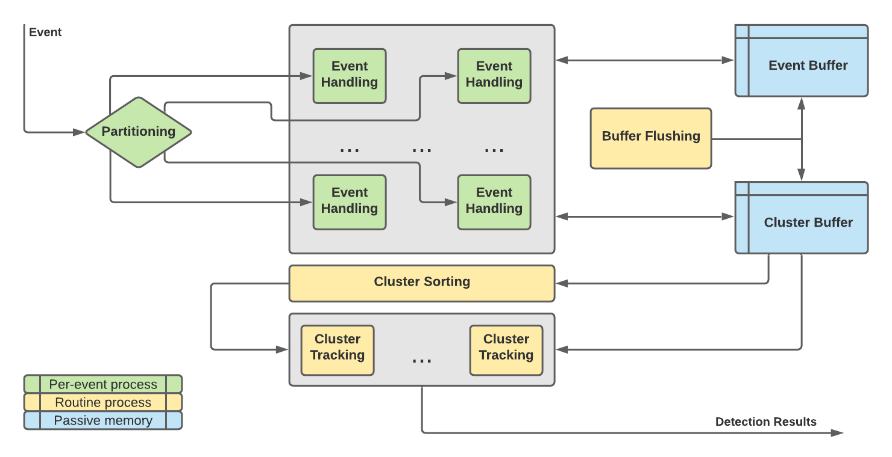
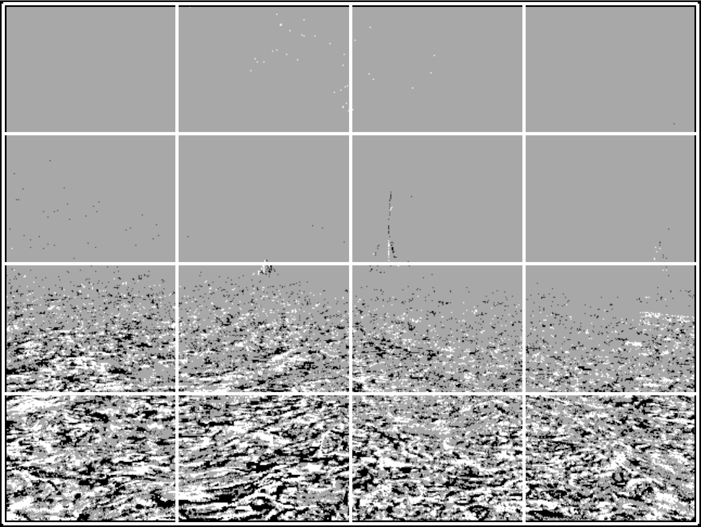

# asynch-cv
Python3 library for asynchronous event-based computer vision algorithms. Provides a layer of abstraction between different event data formats for processing. Currently capable of handling aedat4 and metavision raw or live input.

In order to read Metavision format files or connect to a Prophesee camera, you must install Metavision Designer separately, as Metavision Designer is not publicly available in a package repository.

If using conda, an appropriate environment can be created from the included YAML file with `conda env create --file async-cv.yml`.

Uses Cython for event processing to run in real-time. To build, first execute `python setup.py build_ext -i` to compile the Cython extensions. Requires [CTPL](https://github.com/vit-vit/CTPL) if compiled with thread support. To install CTPL, simply clone the repository into a directory parallel to this one. For example, if this repository is cloned into `C:\dev\async-cv`, then clone CTPL into `C:\dev\CTPL`.

Simply run one of the test scripts in `asynch-cv\tests\` for a demonstration.  

# Persistent Motion Detector
C++ application for event-based clustering and tracking. Takes streaming event data from an event camera in the form (x, y, p, t) and outputs a map of each cluster in the camera's field of view, as well as information and analysis results pertaining to a limited selection of clusters.

### Partitioning and Pre-Filter
Divides the field of view into **x_div** horizontal divisions, and **y_div** vertical partitions, resulting in a 2d partition grid. Each partition is assigned to an **EventHandler** instance, which can process events at a rate governed by **us_per_event**, or the number of microseconds allotted to each **EventHandler** instance to process each event. If events fall into a partition with greater frequency, subsequent events will be ignored. This "pre-filter" serves to limit rate of incoming events in each locality, so that especially event-dense partitions will not demand excessive processing.  

### Noise Filter
Each **EventHandler** instance stores every event it receives in a shared **EventBuffer**, which records the most recent **event_buffer_depth** events at each (x, y) location in the field of view. For each incoming event **(x, y, p, t)**, adjacent events in the buffer at locations from (**x**-1, **y**-1) to (**x**+1, **y**+1) are counted if their timestamps are within **tf**, or the filtering threshold, of **t**. If the count is at least **n**, then the incoming event will be assigned to a cluster. Otherwise, it will remain unassigned and be stored in the **EventBuffer** to be counted by future events.  
If an incoming event has enough adjacent events in the **EventBuffer**, then it will be assigned to a cluster.

### Clustering
When an **EventHandler** instance determines that an event has passed the Correlational Filter, it will be assigned to a cluster and its cluster id will be stored in the **EventBuffer** as well. For each incoming event **(x, y, p, t)**, adjacent events in the buffer at locations from (**x**-1, **y**-1) to (**x**+1, **y**+1) are considered if their timestamps are within **tc**, or the clustering threshold, of **t**. The event will be assigned to the adjacent cluster with the earliest birth time whose centroid is within **max_cluster_size** of (**x**, **y**) by manhattan distance. If there are no adjacent clusters, a new cluster id will be randomly selected and a new cluster will be initialized. The **ClusterBuffer** stores the "weight", or number of events belonging to each cluster; "birth", or timestamp of the initiating event; and sums of event positions for fast centroid calculation.

### Buffer Flushing
Every **buffer_flush_period** microseconds, events in the **EventBuffer** with timestamps older than **tc** are unassigned from their respective clusters. This ensures that the cluster centroid will track moving objects across the field of view, by only considering the most recent events.

### Cluster Analysis
After events are clustered, every active cluster is sorted by weight and birth time, and the first **num_cluster_analyzers** clusters in either order are each assigned to a **ClusterAnalyzer** instance for further processing. Once a cluster has been assigned to a **ClusterAnalyzer** it will not be unassigned until all events in the cluster have expired. Each **ClusterAnalyzer** instance will record the centroid of its cluster every **sample_period** microseconds, retaining a collection of past samples for both the last **long_duration** and **short_duration** microseconds. These samples are used to evaluate centroid movement over time and determine the persistance of motion of each cluster.
